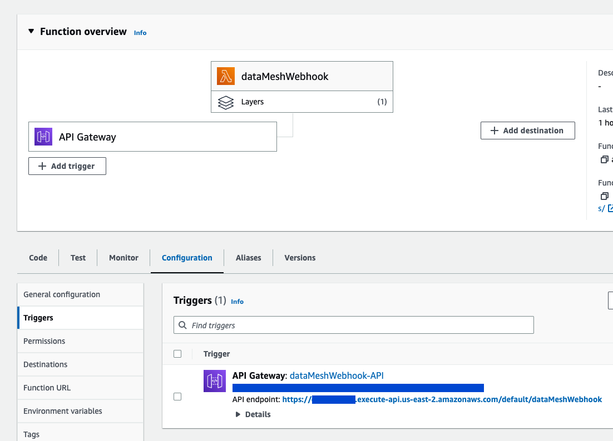
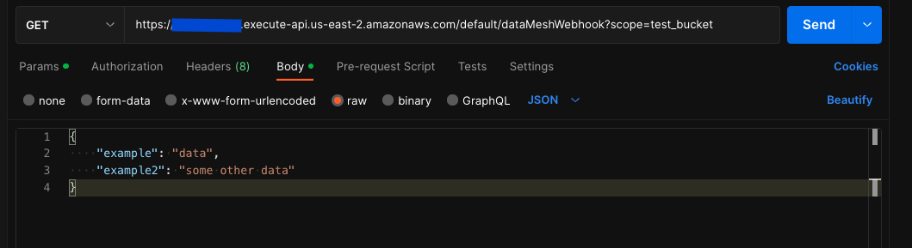

# S3 DataLake Quickstart
This project to configure S3 data-lake leveraging webhooks from various input sources

#### Usage
Once configured you can access your URL from going to your Lambda clicking on your API GATEWAY and looking for API endpoint.

This url can be sent any json object and it will be sent to the s3 bucket under the scope variable

### Notes
You may want to add an authentication layer or a SECRET for access this api endpoint but it is not required or covered here.
To protect yourself from lambda abuse it's strongly recommended that you enable pricing alerts on your AWS instance.
Additionally adjust your maximum concurrency to a reasonable rate under Lambda > Concurrency > Edit

### Requirements
* [AWS account](https://aws.com/) - To create your webhook (lambda), storage (s3) and queries using Athena 

#### Optional
* [Postman](https://www.postman.com/) - to test your working configuration
* [Google Drive](https://drive.google.com/) - a google drive account where you can add app scripts 

#### Resources
* [webhook.site](https://webhook.site/) Useful site for testing if your webhooks are working properly

### Setup

### Setting up your Web Hook
1. Create the S3 Bucket
   * In aws navigate to the S3 console
   * Click Create Bucket (name your bucket something like my-datalake)
   * Select any region (this determines storage costs and access speeds)
   * All the default sare fine, Create Bucket
   * _Note: You will need to go to your bucket > properties and copy the ARN for later_
2. Create a Lambda in AWS
   * Use a node.js runtime (tested with 18.x)
   * x86_64
   * Enable Function URL
   * Auth Type: None
   * Configure CORS
3. Create the layer bundle [knowledge center post](https://repost.aws/knowledge-center/lambda-layer-aws-sdk-latest-version)
   * create a nodejs project `mkdir -p aws-sdk-layer/nodejs`
   * move into the dir `cd aws-sdk-layer/nodejs`
   * npm install the sdk `npm install aws-sdk`
   * zip the directory `zip -r ../package.zip ../`
4. Upload the layer to AWS Lambda Layers
   * Go to lambda layers
   * Create a layer (name it something like aws-sdk)
     * give it a description like aws-sdk for node
   * upload the zipped project file
   * select the x86_64 architecture (optional)
   * select the same runtime as the lambda (optional)
5. Attach the aws-sdk layer
   * Select add layer from the lambda
   * Chose custom layers
   * Select the layer from the dropdown (it might take a minute to show up - refresh and try again)
6. Add a API GATEWAY Trigger
   * Create a new API
   * HTTP Api
   * Security: Open
   * Cross-origin resource sharing (CORS): enabled
7. Add the lambda code
   * Copy the code from code/lambdas/index.mjs into the lambda code section
   * Update the bucket name to match your s3 bucket name
   * Click Deploy
8. Add permission for your Lambda to write to the S3 bucket
   * In the lambda go to Configuration and look for Execution Role
   * Click on the role
   * From the IAM > Roles > thisrole screen select Add Permissions > Attach Policies
   * Create a new Policy, select JSON and paste in the policy listed in code/AWS/policies/lambdaS3PutPolicy.json
   * Update `"arn:aws:s3:::EXAMPLE-BUCKET/*"` to your bucket ARN keeping the wildcard (/*) at the end
